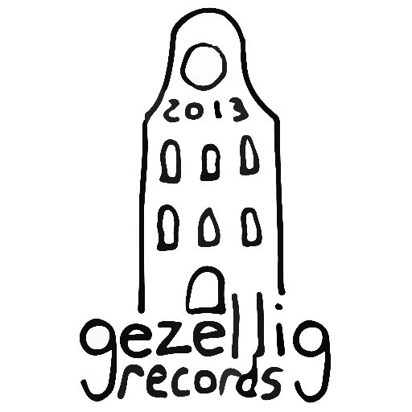

### About

Gezellig Records is a small, independent label based out of Knoxville, Tennessee. Originally conceived in 2013 in a small apartment in Utrecht, Netherlands, Gezellig Records finally came to be in 2016.

Gezellig Records' name comes from the Dutch word *Gezelligheid*, for which there is no direct English translation. It can be understood to mean a feeling of belonging and togetherness. It can also mean a nice, cozy, and fun atmosphere. The positive experience shared with others is the thread that ties the translations together.

The goal of Gezellig Records is to create a cozy atmosphere and bring artists and listeners together.

### Demos

As much as we love hearing new music, we don't have the staff, bandwidth, or time to sit and listen to demos at this time. If you still would like to send demos, please send links to gezelligrecords@gmail.com. No attachments please. While we can't guarantee a response, please understand it may be weeks before we have a chance to listen, if at all.

### Staff

*   Ben T O Smith // Founder  -  gezelligrecords@gmail.com
